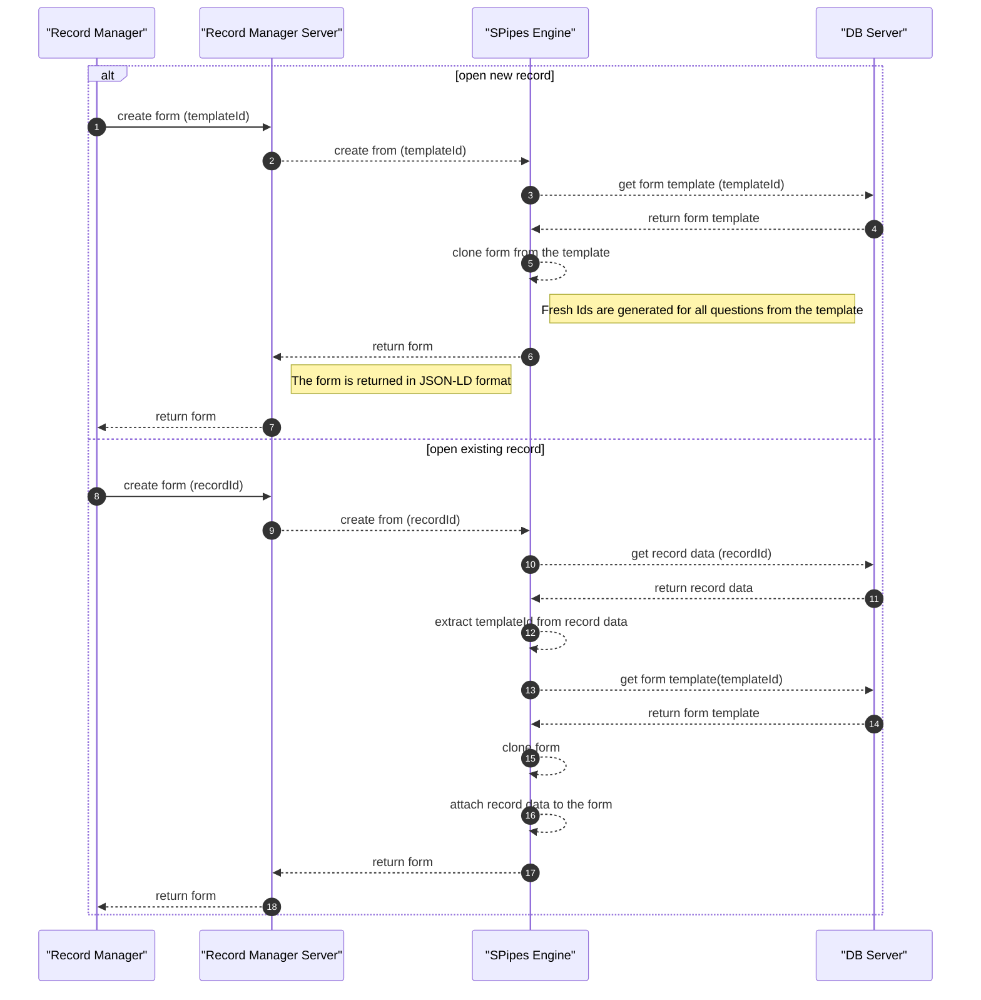

## Form generation

Record Manager uses form templates to generate forms for data entry. Each form template defines the structure
and fields of a form, as well as interactions between fields (e.g., visibility conditions, calculations, etc.).
When a form is generated, it is created based on a selected form template.

The following diagram illustrates typical process (implemented in
[form-generation-sms.ttl](../deploy/shared/s-pipes-engine/scripts/form-generation.sms.ttl)) of form generation
in two scenarios:

1. When a new record is opened (i.e., a form is created from a template).
2. When an existing record is opened (i.e., a form is created from a template and populated with existing record data).

